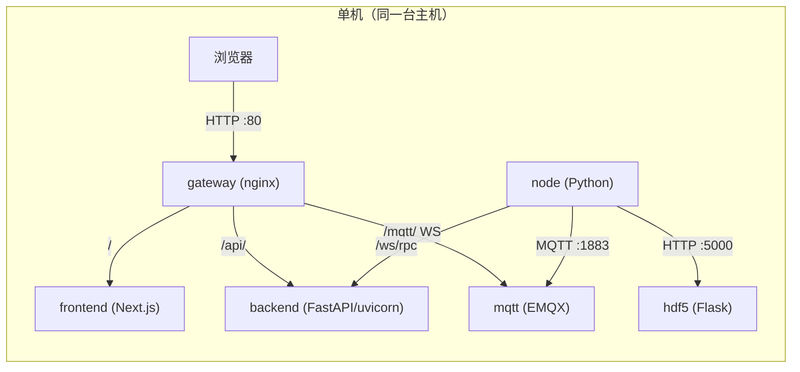
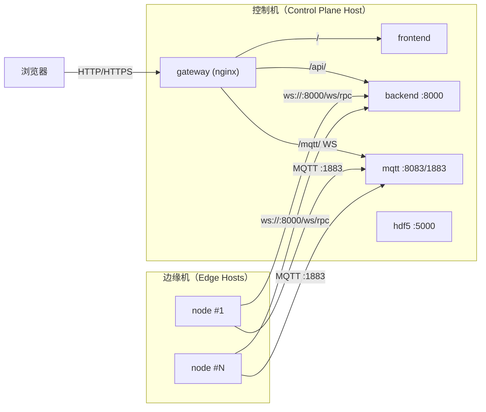

# EasyTeleop-AIO

EasyTeleop 系统一键部署解决方案，集成了必要组件与服务，简化安装与配置流程。

## 文档入口

- 文档索引：`doc/README.md`
- 部署（单机/多机）：`doc/deployment/README.md`
- 快速开始：`doc/quickstart.md`
- 配置说明：`doc/configuration.md`

## 项目概述

EasyTeleop-AIO 是一个为 EasyTeleop 系统提供一键部署功能的集成化工具，旨在简化系统的安装与配置流程。该项目包含了以下三个核心子模块：

1. [EasyTeleop-Node](https://github.com/SZUEAILab/EasyTeleop-Node) - 分布式遥操作系统的节点组件，负责直接控制硬件设备并与后端服务通信
2. [EasyTeleop-Backend-Python](https://github.com/SZUEAILab/EasyTeleop-Backend-Python) - Python后端服务，负责设备控制和状态管理
3. [EasyTeleopFrontend](https://github.com/SZUEAILab/EasyTeleopFrontend) - 基于Next.js的前端用户界面

## 系统要求（开发/运行）

- Python 3.7+
- Node.js 16+
- pnpm 包管理器
- uv Python包管理工具
- 支持的操作系统：Windows、Linux、macOS
- Docker（用于运行服务/Compose 部署）

## 部署

部署文档入口：`doc/deployment/README.md`

### 镜像获取（Release / 本地构建）

你可以选择以下两种方式获取/准备镜像：

1) **从 GitHub Releases 下载离线镜像 tar 并导入（推荐离线/弱网）**

- 下载地址：`https://github.com/SZUEAILab/EasyTeleop-AIO/releases`
- 选择与你的平台架构匹配的产物（例如 `amd64` 或 `arm64`）并下载
- 导入镜像（需要导入四个image）：

```bash
docker load -i <downloaded>.tar
```

导入后启动：

```bash
docker compose up -d
```

2) **本地构建**

如果没有克隆子模块内容，首先运行：

```bash
git submodule update --init --recursive
```

然后运行`docker compose up -d`会自动构建并拉起所有需要的容器，注意该步骤需要良好的网络环境

离线/镜像打包细节见：`doc/deployment/offline-tars.md`

### 部署模式

本仓库支持两种部署模式：

1. **单机 AIO**：所有服务在同一台机器上运行（推荐入门/联调）。
2. **多机集群**：控制机集中运行 `backend/mqtt/gateway/frontend/(hdf5)`，多个边缘机分别运行 `node`（推荐生产/多节点）。

### 拓扑示意

#### 单机 AIO（单机全家桶）



#### 多机集群（控制机 + 多边缘机）



### 单机 AIO（Docker Compose）快速启动

在仓库根目录执行：

```bash
docker compose up -d
```

访问：

- Web 入口（推荐）：`http://localhost/`
- EMQX Dashboard：`http://localhost:18083/`（默认账号密码：`admin/admin`）

更多说明见：`doc/deployment/aio-single.md`

### 多机集群部署

多机集群部署时，边缘机上的 `node` 需要配置为指向控制机可访问地址（`BACKEND_URL/WEBSOCKET_URI/MQTT_BROKER/...`）。

详见：`doc/deployment/cluster-multihost.md`

### 访问入口与默认端口

- 单机 AIO（推荐入口）：`http://localhost/`（通过 `gateway` 统一反代）
- 后端：`http://localhost:8000/`
- HDF5：`http://localhost:5000/`
- MQTT WebSocket（直连 EMQX）：`ws://localhost:8083/mqtt`
- EMQX Dashboard：`http://localhost:18083/`（默认账号密码：`admin/admin`）

## 开发

适用场景：开发/调试子模块，按需分别启动（前端默认 `:3000`）。

### 1) 克隆项目

```bash
git clone --recurse-submodules https://github.com/SZUEAILab/EasyTeleop-AIO.git
cd EasyTeleop-AIO
```

注意：使用 `--recurse-submodules` 参数确保所有子模块都被正确克隆。

如果已经克隆但没有子模块内容，可以运行：

```bash
git submodule update --init --recursive
```

### 2) 安装依赖

根据您的操作系统选择相应的部署脚本：

#### Windows系统：
```cmd
deploy.bat
```

#### Linux/macOS系统：
```bash
chmod +x deploy.sh
./deploy.sh
```

### 3) 启动 MQTT（推荐 Docker）

系统使用 EMQX 作为 MQTT 消息代理服务，推荐使用 compose 启动 `mqtt` 服务：

```bash
docker compose up -d mqtt
```

服务会映射以下端口：

- 1883: MQTT 端口
- 8083: WebSocket 端口
- 8084: SSL WebSocket 端口
- 8883: MQTT SSL 端口
- 18083: Dashboard 管理界面端口

### 4) 启动服务

项目包含独立的服务启动脚本（分别启动）：

#### Windows系统：
```cmd
start-node.bat      # 启动节点服务
start-backend.bat   # 启动后端服务
start-frontend.bat  # 启动前端服务
```

#### Linux/macOS系统：
```bash
chmod +x start-node.sh start-backend.sh start-frontend.sh
./start-node.sh      # 启动节点服务
./start-backend.sh   # 启动后端服务
./start-frontend.sh  # 启动前端服务
```

### 服务概览

1. **Node服务**：负责直接控制硬件设备，通过WebSocket与后端通信，使用MQTT同步状态
2. **Backend服务**：提供RESTful API接口，管理设备状态和数据，包括主服务和MQTT同步服务
3. **Frontend服务**：提供Web管理界面，用户可以通过浏览器访问和控制整个系统

### 故障排除

1. 如果遇到权限问题，请确保脚本具有执行权限
2. 如果依赖安装失败，请检查网络连接和相关工具是否正确安装
3. 确保各服务所需的端口未被占用

### 更新子模块

要更新到最新的子模块代码：

```bash
git submodule update --remote --merge
```

## 构建

### 多架构镜像（buildx bake）

构建并推送多架构镜像（amd64+arm64）：

```powershell
$env:IMAGE_REPO="docker.io/<user>"   # 或 "ghcr.io/<org>"
$env:TAG="v1.0.0"
docker buildx bake -f docker-bake.hcl multi --push
```

### 离线部署（镜像 tar）

- 导出/导入与 tag 对齐：`doc/deployment/offline-tars.md`

导出离线 tar 包（每个架构一个 tar，每个 tar 包含全部镜像）：

Windows（CMD，使用 `.bat`）：

```cmd
export-tars.bat --image-repo easyteleop --tag latest --out-dir dist --arch both
```

Linux/macOS：

```bash
chmod +x ./export-tars.sh
./export-tars.sh --image-repo easyteleop --tag latest --out-dir dist
```

默认导出完成后会清理本地用于打包的镜像（节省磁盘空间）；如需保留，加 `--keep-images`。

每个架构的 tar 包包含 6 个镜像：

- `${IMAGE_REPO}/backend:${TAG}`
- `${IMAGE_REPO}/node:${TAG}`
- `${IMAGE_REPO}/frontend:${TAG}`
- `${IMAGE_REPO}/hdf5:${TAG}`
- `nginx:1.25-alpine`
- `emqx/emqx:5.3.1`
