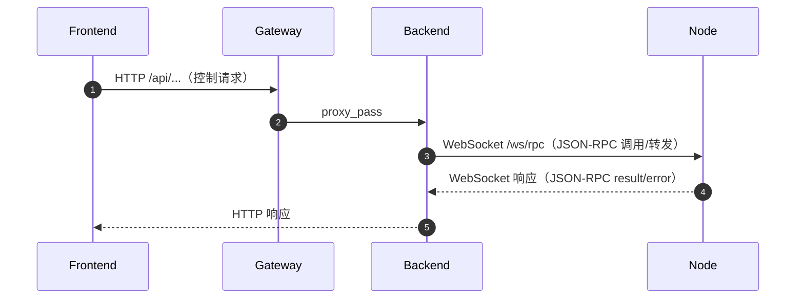
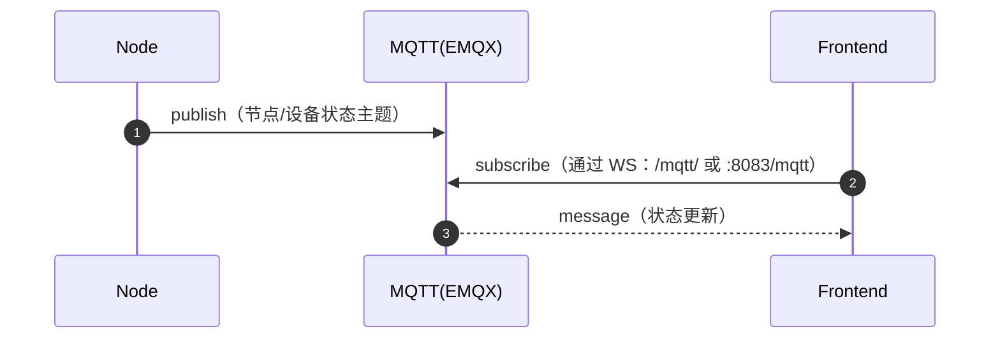

# 架构与数据流（Architecture）

本文描述 EasyTeleop-AIO 在 **单机 AIO** 与 **多机集群** 两种部署模式下的逻辑架构，以及主要数据流。

相关部署文档：

- 单机 AIO：`doc/deployment/aio-single.md`
- 多机集群：`doc/deployment/cluster-multihost.md`

## 组件概览

- `frontend`：Web UI（Next.js），通过 HTTP 调用后端 API，通过 MQTT WebSocket 订阅状态
- `gateway`：Nginx 网关，统一入口（`/`、`/api/`、`/mqtt/`）
- `backend`：后端服务（FastAPI/uvicorn），提供 REST API 与 WebSocket（`/ws/rpc`）
- `mqtt`：消息代理（EMQX），用于节点/设备状态广播与前端订阅
- `node`：边缘节点（Python），负责接入/控制硬件设备，与后端进行 WebSocket/JSON-RPC 通信，并通过 MQTT 发布状态
- `hdf5`：数据可视化服务（Flask），用于展示/读取 HDF5 数据（被 `node` 或 UI 间接使用）

## 逻辑拓扑（Mermaid）

```mermaid
flowchart LR
  Browser["Browser"] -->|HTTP :80| GW["gateway (nginx)"]
  GW -->|/| FE["frontend (Next.js)"]
  GW -->|/api/| BE["backend (FastAPI/uvicorn)"]
  GW -->|/mqtt/ (WS)| MQTT["mqtt (EMQX)"]

  Node["node (Python)"] -->|WebSocket /ws/rpc (JSON-RPC)| BE
  Node -->|MQTT publish/subscribe| MQTT
  Node -->|HTTP :5000| HDF5["hdf5 (Flask)"]
```

## 关键数据流

### 1) 控制流：前端发起控制 → 后端 → 节点



说明：

- `node` 与 `backend` 的 WebSocket 路由为 `backend` 的 `/ws/rpc`。
- 具体 RPC/消息格式参考：`EasyTeleop-Backend-Python/docs/json-rpc.md`、`EasyTeleop-Backend-Python/docs/rpc-forwarding.md`。

### 2) 状态流：节点/设备状态 → MQTT → 前端订阅



说明：

- AIO 默认使用 EMQX（`mqtt`）作为 broker，前端通过 WebSocket 连接。
- 主题与状态同步机制参考：`EasyTeleop-Backend-Python/docs/mqtt.md`。

### 3) 数据流：后端数据落盘（SQLite/文件）

在单机 AIO 默认 Compose 配置下：

- 后端数据卷：`./EasyTeleop-Backend-Python/data` → `/app/data`
- 后端会在该目录下保存数据库/状态等（具体结构见 `EasyTeleop-Backend-Python/docs/database.md`）。

## 部署模式差异要点

### 单机 AIO

- 服务间使用 Compose DNS 名称互联（如 `backend`、`mqtt`、`hdf5`）。
- 建议用户只访问 `gateway`（`http://<host>/`），避免直接暴露后端与 MQTT。

### 多机集群

- 控制面服务在“控制机”，多个 `node` 分别部署在“边缘机”。
- `node` 的 `BACKEND_URL/WEBSOCKET_URI/MQTT_BROKER/VIEW_HDF5_URL` 必须配置为 **可路由的控制机地址**（见 `doc/deployment/cluster-multihost.md`）。

