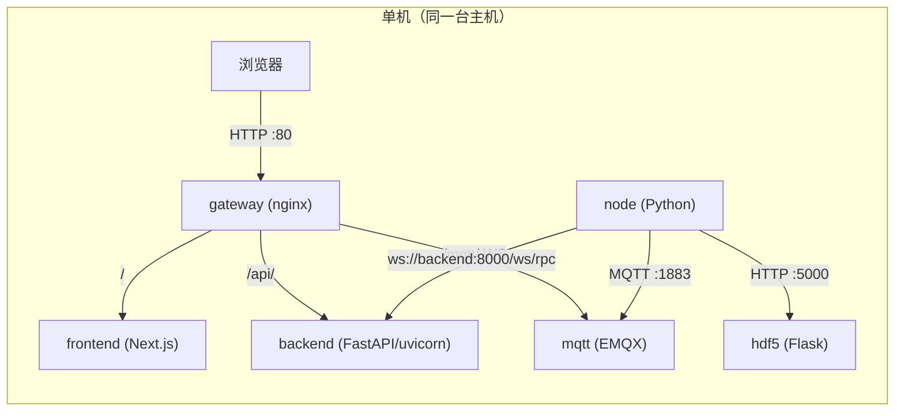

# 单机 AIO 部署（Docker Compose）

适用场景：一台机器上跑全套服务（开发联调、演示、单机部署）。

入口文件：`docker-compose.yml`

## 拓扑（Mermaid）



## 服务说明（与 `docker-compose.yml` 对齐）

### mqtt（emqx/emqx:5.3.1）

- 端口映射：`1883`、`8083`、`8084`、`8883`、`18083`
- 健康检查：`emqx ping`

### backend（easyteleop/backend）

- 依赖：等待 `mqtt` 健康
- 端口映射：`8000:8000`
- 数据卷：`./EasyTeleop-Backend-Python/data:/app/data`
- 环境变量：`DB_DIR`、`MQTT_BROKER`、`MQTT_PORT`

### node（easyteleop/node）

- 依赖：`backend` 启动、`mqtt` 健康
- `privileged: true`：用于需要宿主机硬件访问的场景
- 数据卷：
  - `./EasyTeleop-Node/datasets:/app/datasets`
  - `./EasyTeleop-Node/data:/app/data`
- 环境变量：`BACKEND_URL`、`WEBSOCKET_URI`、`MQTT_BROKER`、`VIEW_HDF5_URL`

### hdf5（easyteleop/hdf5）

- 端口映射：`5000:5000`
- 数据卷：`./HDF5DataVisualize/databases:/app/databases`

### frontend（easyteleop/frontend）

- 不对外暴露端口（推荐走 `gateway`）
- 依赖：`backend` 启动、`mqtt` 健康
- build args：`NEXT_PUBLIC_*`（编译期注入）
- env：`NEXT_PUBLIC_*`（运行期也会提供）

### gateway（nginx:1.25-alpine）

- 对外端口：`80:80`
- 路由模板：`nginx/default.conf.template`
  - `/` → `frontend:3000`
  - `/api/` → `backend:8000/`
  - `/mqtt/` → `mqtt:8083/mqtt/`（WebSocket upgrade）

## 常用命令

启动：

```bash
docker compose up -d
```

查看状态与日志：

```bash
docker compose ps
docker compose logs -f --tail=200 gateway backend node frontend mqtt hdf5
```

停止并删除容器：

```bash
docker compose down
```

