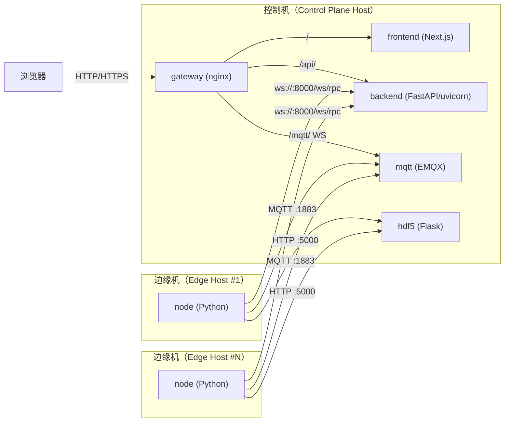

# 多机集群部署（控制机 + 多边缘机）

适用场景：多台机器组成集群，多个 `node` 节点分别靠近硬件/设备部署；控制面（UI/后端/MQTT）集中在一台或少量机器上。

## 角色划分

- **控制机（Control Plane）**：`mqtt`、`backend`、`gateway`、`frontend`、（可选）`hdf5`
- **边缘机（Edge Node）**：一个或多个 `node`（负责设备接入与采集/控制）

> 说明：仓库内 `docker-compose.yml` 是“单机 AIO”写法（服务间用 Compose DNS 名称互联）。多机部署时，跨机器的连接需要改为“可路由的主机/IP”。

## 拓扑（Mermaid）

## 端口开放建议（控制机）

- 对边缘机开放：
  - `1883/tcp`（MQTT）
  - `8000/tcp`（backend HTTP + `/ws/rpc` WebSocket）
  - （可选）`5000/tcp`（hdf5）
- 对浏览器开放：
  - `80/tcp`（或 `443/tcp`，如加 HTTPS）
  - （可选）`18083/tcp`（EMQX Dashboard）

## 关键配置（边缘机的 `node`）

多机时，`node` 相关环境变量应指向“控制机可访问地址”：

- `BACKEND_URL=http://<backend_host>:8000`
- `WEBSOCKET_URI=ws://<backend_host>:8000/ws/rpc`
- `MQTT_BROKER=<mqtt_host>`
- `VIEW_HDF5_URL=http://<hdf5_host>:5000`（如果 hdf5 也集中在控制机）

## 一个最小落地方案（推荐）

1) 控制机：直接使用本仓库 `docker-compose.yml` 启动（或拆分出一份只包含 `gateway/frontend/backend/mqtt/hdf5` 的 compose）。
2) 每台边缘机：只运行 `node` 服务，并把环境变量改为控制机地址；卷挂载保持本机（设备数据/采集数据就近落盘）。

> 如需我按你们的真实机器划分（例如：MQTT 独立机器、后端高可用、网关/前端多副本），我可以基于现有 compose 补一套“多机 compose 模板 + 参数化 env 文件”。

