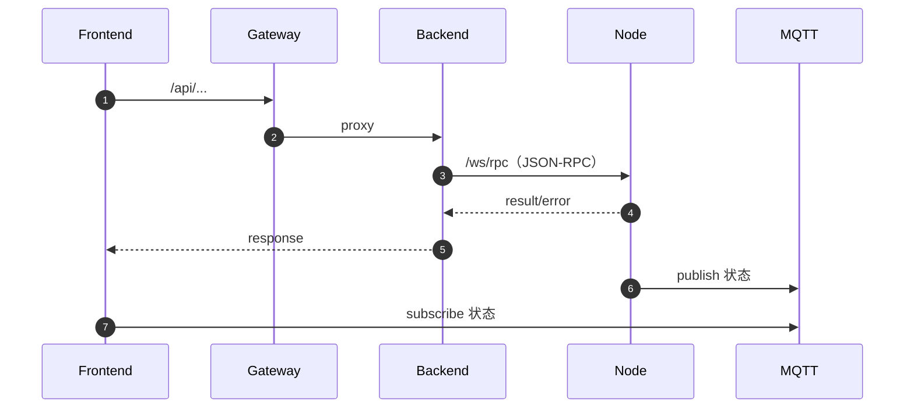

# 模块：Backend（Python）

目录：`EasyTeleop-Backend-Python/`

## 职责

- 提供 REST API（设备、节点、遥操作组等管理）
- 维护 Node 的 WebSocket 连接池，并通过 `/ws/rpc` 将控制命令以 JSON-RPC 方式转发给 Node
- 与 MQTT 协作进行状态同步（主题设计见下方文档入口）

## 运行与端口

- 默认端口：`8000`
- WebSocket：`/ws/rpc`
- Docker 启动：镜像 `easyteleop/backend`（见 `EasyTeleop-Backend-Python/Dockerfile` 与 `docker-compose.yml`）

## AIO（Compose）默认配置映射

来自 `docker-compose.yml`：

- 数据落盘：`./EasyTeleop-Backend-Python/data:/app/data`
- 环境变量：
  - `DB_DIR=/app/data`
  - `MQTT_BROKER=mqtt`
  - `MQTT_PORT=1883`

## 文档入口（后端自带 docs）

后端仓库内已有较完整技术文档（建议从这里开始）：

- `EasyTeleop-Backend-Python/docs/README.md`
- REST API：`EasyTeleop-Backend-Python/docs/api.md`
- 数据库：`EasyTeleop-Backend-Python/docs/database.md`
- JSON-RPC：`EasyTeleop-Backend-Python/docs/json-rpc.md`
- MQTT：`EasyTeleop-Backend-Python/docs/mqtt.md`
- RPC 转发：`EasyTeleop-Backend-Python/docs/rpc-forwarding.md`

## 关键交互（概览）

