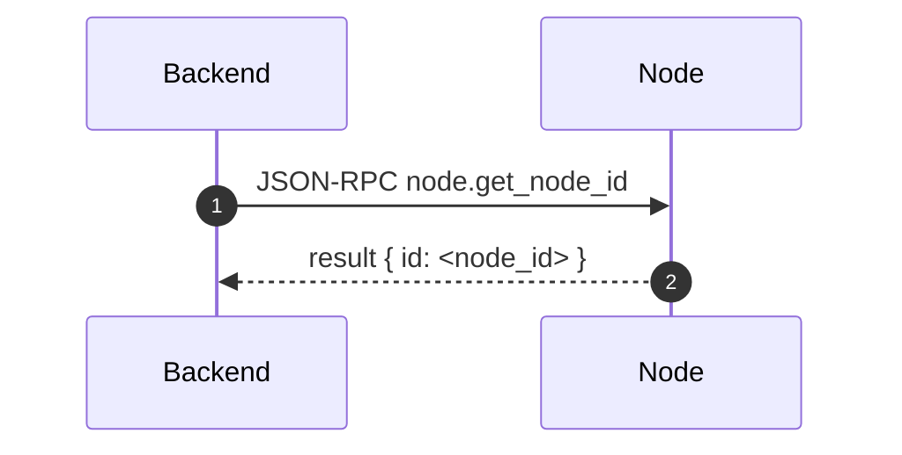
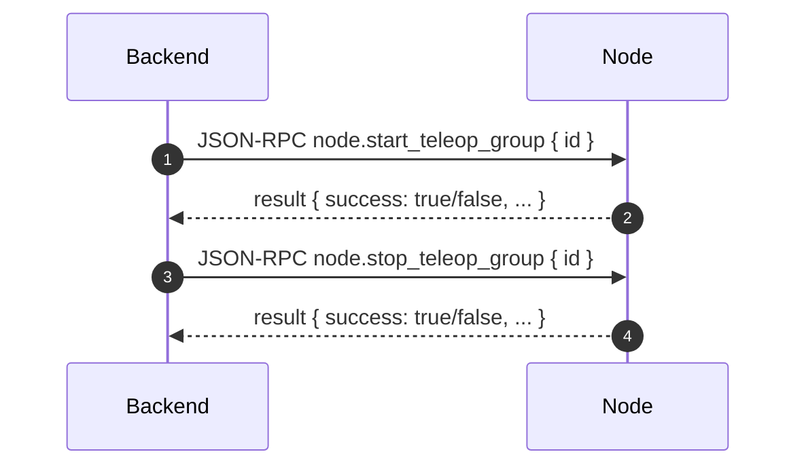

# 模块：Node 协议（WebSocket / JSON-RPC / MQTT）

本文聚合 Node 与后端交互的“最小协议集合”，便于联调与扩展。

权威参考（后端文档）：

- JSON-RPC：`EasyTeleop-Backend-Python/docs/json-rpc.md`
- MQTT：`EasyTeleop-Backend-Python/docs/mqtt.md`
- RPC 转发：`EasyTeleop-Backend-Python/docs/rpc-forwarding.md`

## WebSocket 连接

- 后端 WebSocket 路由：`ws://<backend_host>:8000/ws/rpc`
- Node 侧环境变量：`WEBSOCKET_URI`
- 后端会维护 Node 连接池，用于后续 RPC 转发

## JSON-RPC 方法（Node 实现）

从 `EasyTeleop-Node/node.py` 的注册可见核心方法（节选）：

- `node.get_node_id`
- `node.get_device_types`
- `node.get_teleop_group_types`
- `node.test_device`
- `node.update_config`（通知：后端更新配置后要求 Node 刷新）
- `node.start_teleop_group`
- `node.stop_teleop_group`

> 注意：后端文档 `EasyTeleop-Backend-Python/docs/json-rpc.md` 中存在部分方法名/示例的历史拼写（例如 `start_teleop-group`），以代码实现与后端实际调用为准：`start_teleop_group` / `stop_teleop_group`。

## 典型交互

### 1) Node 连接后：后端获取 node_id

### 2) 后端启动/停止遥操作组

## MQTT 主题（状态同步）

主题设计来自：`EasyTeleop-Backend-Python/docs/mqtt.md`

- `node/{id}/status`
  - Node 上线后发布 `1`
  - 配置 LWT：异常离线时发布 `0`
- `node/{id}/device/{id}/status`（payload：`0/1/2`）
  - `0` 未启动
  - `1` 启动且连接成功
  - `2` 启动但连接异常（重试中）
- `node/{id}/teleop-group/{id}/status`（payload：`0/1`）
- `node/{id}/teleop-group/{id}/collecting`（payload：`0/1`）

